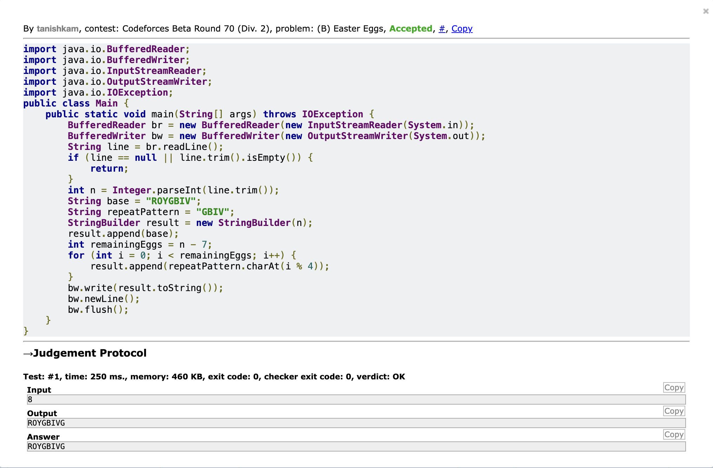

# Codeforces 78B — Easter Eggs

## Brief Description

The problem asks us to construct a string of length `n` using the rainbow colors.

The first 7 characters are fixed as:

`ROYGBIV`

For the remaining characters, we repeatedly use the pattern `GBIV` until the string reaches length `n`.

## Solution / Approach

1. Start with the string `ROYGBIV`.
2. Calculate the number of remaining characters as `n - 7`.
3. Append characters from `GBIV` cyclically.
4. Use `i % 4` to select the correct character from `GBIV`.
5. Print the resulting string.

## Code

```java
import java.io.BufferedReader;
import java.io.BufferedWriter;
import java.io.InputStreamReader;
import java.io.OutputStreamWriter;
import java.io.IOException;
public class Main {
    public static void main(String[] args) throws IOException {
        BufferedReader br = new BufferedReader(new InputStreamReader(System.in));
        BufferedWriter bw = new BufferedWriter(new OutputStreamWriter(System.out));
        String line = br.readLine();
        if (line == null || line.trim().isEmpty()) {
            return;
        }
        int n = Integer.parseInt(line.trim());
        String base = "ROYGBIV";
        String repeatPattern = "GBIV";
        StringBuilder result = new StringBuilder(n);
        result.append(base);
        int remainingEggs = n - 7;
        for (int i = 0; i < remainingEggs; i++) {
            result.append(repeatPattern.charAt(i % 4));
        }
        bw.write(result.toString());
        bw.newLine();
        bw.flush();
    }
}
```

## Accepted Solution Proof

