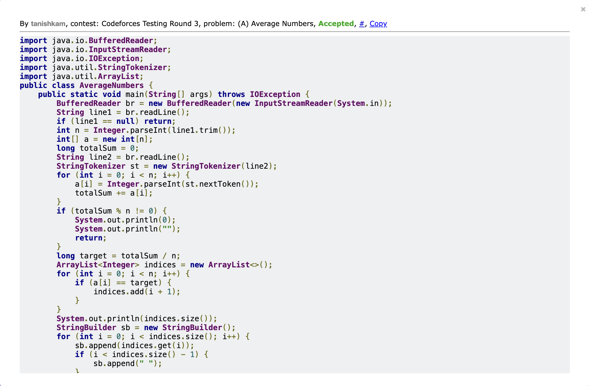

# Codeforces 134A — Average Numbers

## Brief Description

The problem gives us `n` integers and asks us to find the positions of all elements that are equal to the average value of the entire sequence.

We first calculate the total sum of all elements. If the total sum is divisible by `n`, we calculate the average and find all elements equal to that average.

If the average is not an integer, there are no valid positions.

## Solution / Approach

1. Read `n` and the array.
2. Calculate the total sum of all elements.
3. Check whether `totalSum` is divisible by `n`.
4. If it is not divisible, print `0` and an empty line.
5. Otherwise, calculate the target average using `totalSum / n`.
6. Traverse the array and store the 1-based indices of elements equal to the target.
7. Print the number of such indices followed by the indices.

## Code

```java
import java.io.BufferedReader;
import java.io.InputStreamReader;
import java.io.IOException;
import java.util.StringTokenizer;
import java.util.ArrayList;
public class AverageNumbers {
    public static void main(String[] args) throws IOException {
        BufferedReader br = new BufferedReader(new InputStreamReader(System.in));
        String line1 = br.readLine();
        if (line1 == null) return;
        int n = Integer.parseInt(line1.trim());
        int[] a = new int[n];
        long totalSum = 0;
        String line2 = br.readLine();
        StringTokenizer st = new StringTokenizer(line2);
        for (int i = 0; i < n; i++) {
            a[i] = Integer.parseInt(st.nextToken());
            totalSum += a[i];
        }
        if (totalSum % n != 0) {
            System.out.println(0);
            System.out.println("");
            return;
        }
        long target = totalSum / n;
        ArrayList<Integer> indices = new ArrayList<>();
        for (int i = 0; i < n; i++) {
            if (a[i] == target) {
                indices.add(i + 1);
            }
        }
        System.out.println(indices.size());
        StringBuilder sb = new StringBuilder();
        for (int i = 0; i < indices.size(); i++) {
            sb.append(indices.get(i));
            if (i < indices.size() - 1) {
                sb.append(" ");
            }
        }
        System.out.println(sb.toString());
    }
}
```

## Accepted Solution Proof

